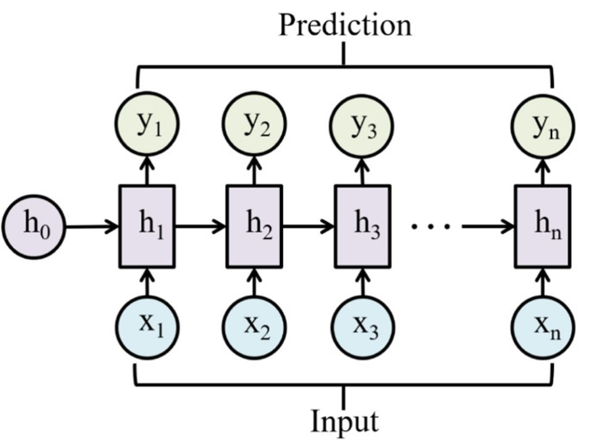
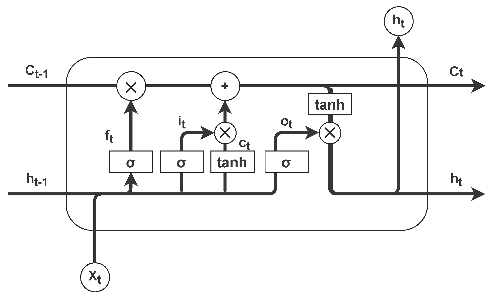
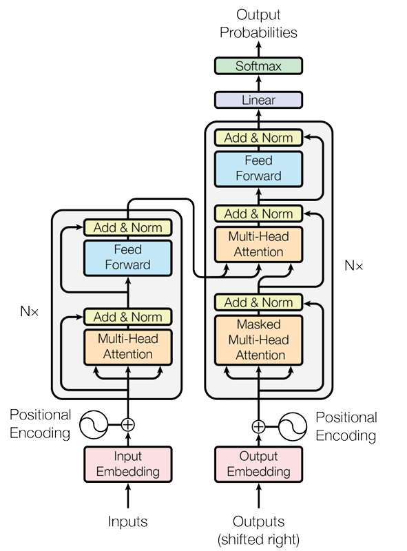

# Modelado de Secuencias: De las RNN a los Transformers

Este documento presenta una introducción al modelado de secuencias mediante redes neuronales recurrentes (RNN), Long Short-Term Memory (LSTM) y Transformers.

---

## 🧠 Red Neuronal Recurrente (RNN)

Una red neuronal recurrente procesa secuencias entrada por entrada. Cada elemento de la secuencia $x_t$ es procesado junto con un estado oculto anterior $h_{t-1}$, y produce una salida $y_t$ y un nuevo estado oculto $h_t$.

  
*Fuente: Figura adaptada de [MDPI Information](https://www.mdpi.com/2078-2489/15/9/517)*

### 📐 Ecuaciones de la RNN

$$
h_t = \tanh(W_{hx} x_t + W_{hh} h_{t-1} + b_h)
$$
$$
y_t = W_{hy} h_t + b_y
$$

donde:
- $x_t \in \mathbb{R}^d$: entrada en el tiempo $t$,
- $h_t \in \mathbb{R}^h$: estado oculto,
- $y_t \in \mathbb{R}^o$: salida,
- $W_{hx}, W_{hh}, W_{hy}$: matrices de pesos,
- $b_h, b_y$: vectores de sesgo.

---

## 🔁 Long Short-Term Memory (LSTM)

Las celdas LSTM permiten preservar información durante lapsos de tiempo largos, mitigando los problemas de las RNN estándar.

  
*Fuente: Figura adaptada de [MDPI Information](https://www.mdpi.com/2078-2489/15/9/517)*

### 🔣 Ecuaciones de la celda LSTM

$$
\begin{aligned}
f_t &= \sigma(W_f x_t + U_f h_{t-1} + b_f) \\
i_t &= \sigma(W_i x_t + U_i h_{t-1} + b_i) \\
\tilde{c}_t &= \tanh(W_c x_t + U_c h_{t-1} + b_c) \\
c_t &= f_t \odot c_{t-1} + i_t \odot \tilde{c}_t \\
o_t &= \sigma(W_o x_t + U_o h_{t-1} + b_o) \\
h_t &= o_t \odot \tanh(c_t)
\end{aligned}
$$

donde:
- $\sigma$: función sigmoide,
- $\odot$: producto elemento a elemento.

### Estados internos: memoria a largo y corto plazo

En una LSTM, se distinguen dos representaciones internas fundamentales:

* **Memoria a largo plazo: $c\_t$ (estado de celda)**
  Este vector transporta información a través del tiempo con mínima modificación, controlado por las compuertas de olvido ($f_t$) y entrada ($i_t$). Gracias a su diseño, permite conservar dependencias a largo plazo dentro de una secuencia sin ser afectado significativamente por las activaciones no lineales. Es el principal responsable de almacenar información duradera.

* **Memoria a corto plazo: $h_t$ (estado oculto)**
  Este vector es la salida de la celda en cada paso de tiempo, modulado por la puerta de salida ($o_t$) y la activación del estado de celda. Su función es capturar el contexto inmediato y servir como entrada para otras capas o como predicción, pero con menor capacidad para mantener información persistente en el tiempo.

---
## ✨ Transformers

Los Transformers eliminan completamente la recurrencia y permiten el paralelismo total, basándose en mecanismos de atención, lo que los hace altamente eficientes para procesar secuencias largas y complejas.

*Fuente: Figura adaptada de [Attention is All You Need](https://arxiv.org/pdf/1706.03762)*

### 🔍 Atención Escalar de Producto

Dado un conjunto de **consultas** $Q$, **claves** $K$, y **valores** $V$, la atención se calcula como:

$$
\text{Attention}(Q, K, V) = \text{softmax}\left(\frac{QK^T}{\sqrt{d_k}}\right)V
$$

donde $d_k$ es la dimensión de las claves.

#### 📌 ¿Qué representan $Q$, $K$ y $V$?

* **Consulta (Query, $Q$)**: representa el vector que busca información relevante en el contexto. Por ejemplo, puede corresponder a una palabra cuya representación está siendo generada.
* **Clave (Key, $K$)**: codifica las características que hacen que un elemento de la secuencia sea relevante para una determinada consulta.
* **Valor (Value, $V$)**: contiene la información **que será combinada para formar la salida** del mecanismo de atención. Una vez se determina qué tan relevante es cada clave, los valores asociados se combinan mediante una media ponderada, usando los coeficientes de atención (calculados a partir de $Q$ y $K$).

> Es importante notar que **los valores no participan en el cálculo de relevancia**, sino que aportan el contenido final que será agregado según dicha relevancia. En PLN, por ejemplo, los valores pueden contener significados latentes de palabras, y la atención pondera cuáles de esos significados deben influir más en la salida.

---

### 🧩 Single-head vs Multi-head Attention

* **Single-head attention:** se realiza una única operación de atención sobre una única proyección de $Q, K, V$, por lo que la atención aprende una sola función de similitud y combinación de contexto.

* **Multi-head attention:** se realizan múltiples proyecciones lineales distintas de $Q, K, V$, permitiendo que el modelo aprenda distintas relaciones en paralelo. Cada cabeza opera en un subespacio diferente y captura patrones complementarios. Las salidas de todas las cabezas se concatenan y se proyectan de nuevo para generar la salida final:

$$
\text{MultiHead}(Q, K, V) = \text{Concat}(\text{head}_1, \dots, \text{head}_h)W^O
$$

donde cada cabeza se calcula como:

$$
\text{head}_i = \text{Attention}(QW_i^Q, KW_i^K, VW_i^V)
$$

Este mecanismo es esencial para capturar relaciones sintácticas, semánticas y de dependencia de largo alcance en tareas de lenguaje natural.

---

### ⚙️ Arquitectura General

* **Codificador (Encoder):** Consiste en capas de atención multi-cabeza seguidas de redes feedforward totalmente conectadas, aplicadas sobre cada posición.
* **Decodificador (Decoder):** Además de las capas del codificador, incluye atención enmascarada (para prevenir que se atienda al futuro) y mecanismos que conectan con la salida del codificador.
* **Positional Encoding:** Se suma a los embeddings para introducir información de orden en la secuencia, ya que el modelo por sí mismo no es recurrente ni convolucional.

Los Transformers son la base de modelos modernos de lenguaje como **BERT**, **GPT**, **T5**, entre otros, y han transformado el estado del arte en tareas como traducción automática, resumen, clasificación de texto y generación de lenguaje.

---

